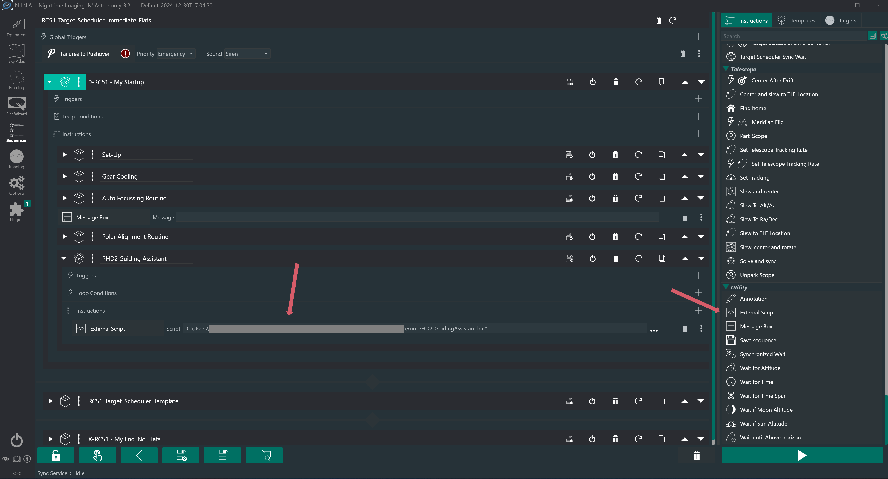

# PHD2 Guiding Assistant automation for N.I.N.A.

Runs PHD2's Guiding Assistant automatically, once per night, as a step in
an N.I.N.A. sequence. It positions the mount, starts guiding, measures
tonight's seeing and the behaviour of the mount and guiding subsystem,
applies PHD2's recommended minimum-move values, and sends the mount home
— with no clicking.

Seeing changes from night to night, so guiding parameters tuned last week
may not suit this evening. This automates the measurement that keeps them
current.

The Guiding Assistant isn't exposed in PHD2's API, so that part is driven
through the Windows API. Everything else goes over PHD2's JSON-RPC socket
and ASCOM.

> **Status:** working, suitable for unattended use, and language-independent.
>
> Run under real sky on 30 July 2026 — real mount, real guide camera,
> launched from N.I.N.A., finished in under four minutes with no
> warnings. Verified again on 31 July with the desktop session
> **disconnected** throughout, and in **ten languages** including Russian,
> Arabic and Japanese. Failure guards individually provoked and confirmed.
> See [Test status](#test-status),
> [Running fully unattended](#running-fully-unattended) and
> [Languages other than English](#languages-other-than-english).

## Who this is for

Rigs that stay put — **permanent or semi-permanent** installations, where
the geometry is much the same from one night to the next. Semi-permanent
means a fully assembled rig carried out and set down, or one wheeled out
on a cart to a levelled, marked spot needing only minimal polar
alignment.

It assumes PHD2 is **already calibrated**, declination backlash has
**already been measured**, and the mount is reasonably well tuned. It
refines guiding parameters; it doesn't fix mechanics.

**If you break the rig down after every session, use PHD2's Guiding
Assistant by hand.** You'll be recalibrating anyway, and you're standing
right there.

## Which files do I need?


**Just these two.** Put them in the same folder and point N.I.N.A.'s
*External Script* instruction at the `.bat`:

| File | Purpose |
|---|---|
| `PHD2_GuidingAssistant.ps1` | The routine itself |
| `Run_PHD2_GuidingAssistant.bat` | What N.I.N.A. calls; holds the three settings |

**Optional extras.** Standalone tools — the main routine never calls
them, and it works fine without them:

| File | When you'd want it |
|---|---|
| `TEST_Simulate_PHD2_GuidingAssistant.bat` | Rehearse a run without moving the mount |
| `Convert-AltAzToDecHA.ps1` | Work out Dec/hour-angle numbers if you think in Alt/Az |
| `Dump-AscomCapabilities.ps1` | Ask a mount driver what it actually supports |
| `Run_Dump-AscomCapabilities.bat` | Double-click front end for the above |
| `HOWTO_Dump_Capabilities.md` | Instructions to send with the dump tool |
| `ASCOM_Mount_Capabilities.md` | Collected results from different mount drivers |

**Requirements:** Windows, PHD2, the ASCOM Platform and your mount's
driver. Nothing to install — the scripts use Windows PowerShell 5.1,
which ships with Windows.

## Why run the Guiding Assistant?

PHD2's Guiding Assistant switches guide output **off** and simply watches
an unguided star for a couple of minutes. That gives it a clean look at
what the sky and the mount are really doing tonight, uncontaminated by
the guider's own corrections:

- **High-frequency star motion** — the seeing
- **Drift rates** in right ascension and declination
- **Polar alignment error**, measured independently of your alignment routine
- **Declination backlash**, if you ask for it

The most useful thing it produces is a recommended **minimum move** for
each axis: the threshold below which the guider should not react at all.

That threshold matters more than it sounds. Set it too low and the
guider chases the seeing — issuing corrections for motion that has
already reversed by the time the pulse lands, which makes tracking worse
than doing nothing. Set it too high and genuine drift goes uncorrected.
The right value sits just above the night's seeing.

And that is the point: **seeing changes from night to night**, and often
through a single night. A min-move that was right last week may be wrong
this evening. Since measuring it is mechanical, takes a few minutes, and
wants doing at the start of every session, it is worth automating — which
is all this script is.

It also gives you a free second opinion on your polar alignment, from a
completely different method to whatever you aligned with.

## What the script does


1. Connects to PHD2 (TCP 4400) and to the mount through GSS.
2. Pre-flight: PHD2 reachable, equipment connected, **calibration exists**.
3. Slews to Dec 0°, hour angle +5° (west of meridian), approaching from
   1° **south** so the final move is northward and clears Dec backlash.
4. `stop_capture` → `loop` → `find_star` → `guide` (with `recalibrate: false`).
5. Opens the Guiding Assistant, runs it for 130 s, stops it, clicks every
   enabled `Apply` button.
6. Verifies the min-move values actually changed, via the API.
7. `stop_capture`, then `FindHome()`, then exits.

Runs once per night, called from N.I.N.A.'s Advanced Sequencer using the
**Utility → External Script** instruction.



*Drag **External Script** from the **Utility** group in the instruction
palette into your sequence. Here it sits in its own instruction set
inside the startup container, after polar alignment and before imaging
begins.*

## Before first use

Put `PHD2_GuidingAssistant.ps1` and `Run_PHD2_GuidingAssistant.bat` in
the same folder — anywhere you like. Neither file contains a hard-coded
path: the batch finds the script beside itself, and the script writes its
logs to a `logs` subfolder it creates. So no editing is needed to install
them.

> **The one path you must set** is in N.I.N.A.: point the
> *Utility → External Script* instruction at your copy of
> `Run_PHD2_GuidingAssistant.bat`. Quote it if the path contains spaces.

Then work through these three steps in order. Run the PowerShell
commands from the folder containing the scripts.

**1. Check the script parses.** Replace the path with your own — this is
the only place in this README where you need to:

```powershell
$e=$null
[void][System.Management.Automation.Language.Parser]::ParseFile(
    'C:\YOUR\PATH\HERE\PHD2_GuidingAssistant.ps1',
    [ref]$null,[ref]$e); $e
```

No output means it parsed cleanly. Nothing is run and nothing moves.

**2. Dry run.** Exercises the PHD2 connection and the whole Guiding
Assistant automation, but skips every mount operation — no connect, no
slew, no homing:

```powershell
.\TEST_Simulate_PHD2_GuidingAssistant.bat
```

For this you want PHD2 on a profile with its **camera simulator**
(Camera = `Simulator`, Mount = `On-camera`), calibrated once. That gives
a synthetic star field, so it works in daylight or under cloud.

**3. Full run against simulators.** Same again but with the mount layer
live, pointed at a simulated mount — either your hub's own simulator mode
or the ASCOM Telescope Simulator via `-MountProgId`. This is what proves
the slew and stand-down logic before anything real moves.

Only then let it near the telescope.

## Changing the defaults


Three settings live at the top of `Run_PHD2_GuidingAssistant.bat`:

```bat
set "GASECONDS=130"
set "TARGETDEC=0"
set "MERIDIANOFFSET=5"
```

There are two ways to change them. **Method 1 is easier and is the one
to use** unless you have a reason not to.

### Method 1 — edit the file (recommended)

1. Open the folder containing `Run_PHD2_GuidingAssistant.bat`.
2. **Right-click the file → Open with → Notepad.**
   On Windows 11 you may need *Show more options* first. Do **not**
   double-click it — that runs it.
3. Near the top you'll see the `--- SETTINGS ---` block with those three
   lines.
4. Change the number, leaving everything else alone. So to sample for
   four minutes:

   ```bat
   set "GASECONDS=240"
   ```

   - Keep the quotation marks
   - No spaces around the `=`
   - Decimals are fine for the two angles, e.g. `set "MERIDIANOFFSET=7.5"`
   - Negative is fine for the offset, e.g. `set "MERIDIANOFFSET=-5"`
5. **Save** with Ctrl+S and close Notepad.
6. That's it. The next run — whether from N.I.N.A. or by hand — uses the
   new values.

**To check it took effect:** the batch prints the three values when it
starts, and they're recorded in the run log:

```
GA time 240s, Dec 0, meridian offset 5 deg
```

**To undo:** put the original numbers back — `130`, `0`, `5`.

### Method 2 — one-line commands

Useful if you'd rather not open the file, or want to script the change.
Run them in PowerShell **from the folder containing the batch file**:

```powershell
cd 'C:\path\to\your\scripts'
```

Then use whichever command below applies. Each one rewrites a single
line and leaves the rest of the file untouched.

### Guiding Assistant sampling time

```powershell
# set it to 240 seconds
(Get-Content .\Run_PHD2_GuidingAssistant.bat) -replace '^set "GASECONDS=.*"', 'set "GASECONDS=240"' | Set-Content .\Run_PHD2_GuidingAssistant.bat

# back to the default
(Get-Content .\Run_PHD2_GuidingAssistant.bat) -replace '^set "GASECONDS=.*"', 'set "GASECONDS=130"' | Set-Content .\Run_PHD2_GuidingAssistant.bat
```

**Must be greater than 120.** PHD2 enforces a two-minute minimum: ask
for 60 and it opens an "Extended Sampling" window and keeps measuring
until it reaches 120 anyway. So shorter values save no time — they only
make the log messier. The script warns if you set one.

**Longer is worth considering.** The min-move recommendations come from
high-frequency star motion, and 130 s sits barely above PHD2's floor. If
your recommended values swing noticeably from night to night, 240 or 300
will steady them. The cost is a few extra minutes, once per session.

### Where the mount points to measure

```powershell
# example: Dec +10, 8 degrees EAST of the meridian
(Get-Content .\Run_PHD2_GuidingAssistant.bat) -replace '^set "TARGETDEC=.*"',      'set "TARGETDEC=10"'      | Set-Content .\Run_PHD2_GuidingAssistant.bat
(Get-Content .\Run_PHD2_GuidingAssistant.bat) -replace '^set "MERIDIANOFFSET=.*"', 'set "MERIDIANOFFSET=-8"' | Set-Content .\Run_PHD2_GuidingAssistant.bat

# back to the defaults: Dec 0, 5 degrees WEST
(Get-Content .\Run_PHD2_GuidingAssistant.bat) -replace '^set "TARGETDEC=.*"',      'set "TARGETDEC=0"'      | Set-Content .\Run_PHD2_GuidingAssistant.bat
(Get-Content .\Run_PHD2_GuidingAssistant.bat) -replace '^set "MERIDIANOFFSET=.*"', 'set "MERIDIANOFFSET=5"' | Set-Content .\Run_PHD2_GuidingAssistant.bat
```

**What the numbers mean**

| Setting | Meaning |
|---|---|
| `TARGETDEC` | Declination in degrees, −90 to +90. `0` is the celestial equator. |
| `MERIDIANOFFSET` | Degrees from the meridian. **Positive = west, negative = east.** |

So `5` means five degrees west of the meridian, which on a German
equatorial puts the telescope on the **east** side of the pier. Use `-5`
for the mirror image on the west side.

**Why the defaults are what they are.** Declination 0 near the meridian
is where guiding behaves most simply: RA corrections aren't compressed by
`cos(dec)`, and the mount is near balance. Those are the conditions PHD2
recommends for calibration, and measuring the sky under the same
conditions is what makes the resulting min-move values representative.

**If you change them, keep the changes modest.** Large declinations
compress the RA axis, and large meridian offsets introduce field rotation
and differential flexure that muddy the seeing measurement — PHD2's own
guidance is to stay within about two hours of the meridian. The script
does not stop you going further; it simply checks you arrived where you
asked.

The post-slew sanity check reads these same values, so it adapts
automatically — no need to touch `-PositionToleranceDeg` unless you want
a tighter or looser tolerance than 3°.

### If you think in Alt/Az

The script takes declination and hour angle, not altitude and azimuth.
There is no fixed conversion between them: **Dec/HA are fixed relative
to the sky, Alt/Az are fixed relative to your horizon**, so the same
Alt/Az corresponds to a different Dec/HA at every latitude. You have to
convert for *your* site.

Use `Convert-AltAzToDecHA.ps1`:

```powershell
.\Convert-AltAzToDecHA.ps1 -Alt 46 -Az 90 -Lat 33.798
```

Azimuth convention: 0 = North, 90 = East, 180 = South, 270 = West.
Latitude is negative in the southern hemisphere. It prints the two lines
to paste into the batch file, and warns if the position you've asked for
is a poor place to measure.

It also works in reverse, to see where your current settings point:

```powershell
.\Convert-AltAzToDecHA.ps1 -Dec 0 -MeridianOffset 5 -Lat 33.798
```

Worked example — **Alt 46°, Az 90° (due east)**:

| Your latitude | `TARGETDEC` | `MERIDIANOFFSET` |
|---|---|---|
| 33.8° (Creator's site) | 23.59 | −49.29 |
| 45.0° | 30.57 | −53.79 |
| 51.5° | 34.26 | −57.19 |
| −33.9° (southern) | −23.65 | −49.32 |

Note the offset comes out **negative**, because due east is east of the
meridian. And note how far negative: −49° is **3.3 hours** from the
meridian, well outside PHD2's recommended two-hour window. That
particular spot is a poor place to measure — the numbers are correct, but
the choice isn't a good one.

For reference, the shipped default of Dec 0 / offset +5 sits at roughly
**Alt 56°, Az 189°** at latitude 33.8° — high up, just west of due
south. That's the kind of position you want.

**Why the script doesn't take Alt/Az directly:** ASCOM does offer
`SlewToAltAz`, but not every driver implements it — the ZWO AM series
reports `CanSlewAltAz = False`, for instance. Converting to Dec/HA works
on every mount, and keeps the target fixed against the sky rather than
drifting relative to it during the measurement.

### One-off overrides

To try something without editing anything, call the script directly:

```powershell
.\PHD2_GuidingAssistant.ps1 -GASeconds 300 -TargetDec 10 -MeridianOffsetDeg -8
```

Add `-Simulate` to rehearse it with no mount movement at all.

## Exit codes


| Code | Meaning |
|---|---|
| 0 | Success (possibly with a logged warning) |
| 10 | PHD2 unreachable / server not enabled |
| 11 | PHD2 equipment not connected |
| 12 | PHD2 not calibrated — script refuses to calibrate |
| 20 | Mount connect failed |
| 21 | Slew failed or timed out |
| 22 | Post-slew position sanity check failed |
| 23 | Mount reports an invalid sidereal time or site location |
| 24 | Driver lacks a capability the script requires |
| 30 | No guide star found |
| 31 | Guiding failed to settle |
| 40 | GA window did not appear |
| 41 | GA `Start` button never enabled |
| 42 | Star lost / PHD2 error alert during the GA run |
| 43 | No `Apply` buttons offered |
| 44 | Min-move values unchanged after Apply |
| 50 | Stand-down (`FindHome` / `Park`) failed or timed out |
| 99 | Unexpected error |

A non-zero exit fails the N.I.N.A. instruction and will fire the
`Failures to Pushover` global trigger (Emergency / Siren). The script
always attempts `stop_capture` + `FindHome()` before exiting, so the rig
is left safe. A timestamped log is written beside the script.

## Test status


| Stage | What | Result |
|---|---|---|
| 1 | Parse check | Pass |
| 2 | `-Simulate`, PHD2 Simulator profile, 130 s | **Pass — exit 0**, 2026-07-26 |
| 3 | Real mount slew + FindHome | **Pass** (accidental full run, 2026-07-26 15:51) — reached Dec 0.00, HA 5.03° W, SideOfPier=0, homed cleanly |
| 4 | Launched from N.I.N.A., real mount, PHD2 simulator | **Pass — exit 0**, 2026-07-26 21:18, 4m00s end to end |
| 5 | Regression after the capability rewrite, real mount | **Pass — exit 0**, 2026-07-27, three consecutive runs |
| 6 | Failure paths | **Pass**, 2026-07-27 — see below |
| 7 | **Full run under real sky** | **Pass — exit 0**, 2026-07-30 21:01, 3m56s |
| 8 | **Run with the desktop session disconnected** | **Pass — exit 0**, 2026-07-31 11:47 |
| 9 | **PHD2 in French** | **Pass — exit 0**, 2026-07-31 12:45 |
| 10 | **PHD2 in German** | **Pass — exit 0**, 2026-07-31 12:58 |
| 11 | **PHD2 in Spanish** | **Pass — exit 0**, 2026-07-31 13:19 — first run, no Spanish strings in the script |
| 12 | **PHD2 in Italian** | **Pass — exit 0**, 2026-07-31 13:26 |
| 13 | **PHD2 in Portuguese** | **Pass — exit 0**, 2026-07-31 13:40 |
| 14 | **PHD2 in Russian** (Cyrillic) | **Pass — exit 0**, 2026-07-31 13:51 — every fallback, no Latin characters anywhere |
| 15 | **PHD2 in Arabic** (right-to-left) | **Pass — exit 0**, 2026-07-31 14:00 — control order not inverted |
| 16 | **PHD2 in Japanese** (CJK) | **Pass — exit 0**, 2026-07-31 14:12 |
| 17 | **PHD2 in Romanian** | **Pass — exit 0**, 2026-07-31 14:18 |

### Real-sky run, 2026-07-30

Launched from N.I.N.A. on the live `Atlas2_290MM` profile with the real
guide camera. Slewed to Dec 0.00 / HA 5.03° west, `SideOfPier` reported
`pierEast`, guiding settled in 16 s, the Guiding Assistant sampled for
130 s and offered two recommendations, both applied:

| | Before | After |
|---|---|---|
| RA min-move | 0.16 | 0.13 |
| Dec min-move | 0.25 | 0.20 |

**No star losses and no warnings** for the whole run. `Measure
Declination Backlash` was found ticked on the live profile and was
unticked by the script, so the session ended when asked rather than
continuing into a backlash measurement.

### Disconnected-session run, 2026-07-31

Started over RDP with a two-minute delay, the RDP client closed before
the script began, and left alone for eight minutes. The run took 2m43s
and completed with exit 0 — menu invoked, dialog found, backlash box
unchecked, 130 s measured, both recommendations applied.

An earlier attempt was discarded because the session was briefly
reconnected mid-run, which would have invalidated the result.

### Failure paths verified 2026-07-27

| Guard | How it was provoked | Result |
|---|---|---|
| Exit 10 | `Tools > Enable Server` unchecked in PHD2 | Failed in 2 s with a clear message |
| Exit 12 | Calibration cleared (needs `Auto restore calibration` off first, or PHD2 restores it) | Refused to run, refused to calibrate |
| Exit 44 no longer spurious | Two runs producing identical recommendations | Warned and continued, exit 0 |
| Extended Sampling | Stop clicked at 30 s, below PHD2's 2-minute minimum | Waited 90 s for the countdown window, then applied |

Note: with `Auto restore calibration` enabled — which it is on this rig —
PHD2 restores the last calibration on reconnect, so exit 12 is unlikely
ever to fire in practice. That is the desired outcome; the guard exists
for the case where calibration genuinely is absent.

Stage 2 verified end to end: menu → window → backlash unchecked →
auto-start detected → 130 s run → Stop → 2 Apply buttons clicked →
min-move confirmed changed via the API (RA 0.18 → 0.0975,
Dec 0.18 → 0.15) → capture stopped → exit 0.

## Moving from simulators to the real sky

- **Switch PHD2 back to your real equipment profile**, and undo anything
  you loosened for simulator testing — `Search region` and
  `Minimum star HFD` are the usual two
- **Confirm `Tools > Enable Server` is checked** in PHD2, and that PHD2's
  equipment is connected
- **Have the mount connected in N.I.N.A. before this instruction runs.**
  In a normal sequence that happens at sunset, several steps earlier
- **Point the External Script instruction at
  `Run_PHD2_GuidingAssistant.bat`**, not the TEST batch — the TEST one
  ends with a `pause`, which N.I.N.A. can never satisfy, so the
  instruction would hang forever
- **Expect about six minutes:** two slews, guiding settle, the GA
  sampling time, applying recommendations, then stand-down

Worth considering for your own profile: `Minimum star SNR for AutoFind`
defaults to 6, which is permissive for a star whose measurements will set
your guiding parameters for the night. PHD2's own guidance for the
Guiding Assistant is a star with SNR of 10 or better.

## Languages other than English

The Guiding Assistant is driven through its window, so the script has to
find buttons whose captions PHD2 translates. **It works in any language**
— ten have been verified end to end, and the design does not depend on
recognising the words.

### Verified languages

Every one of these completed with **exit 0** on 31 July 2026:

| | Latin script | Cyrillic | Right-to-left | CJK |
|---|---|---|---|---|
| | English, German, French, Spanish, Italian, Portuguese, Romanian | Russian | Arabic | Japanese |

That covers every category of writing system. Anything untested — Korean,
Chinese, Greek, Czech, Polish — falls into one of those four buckets, and
each bucket is proven.

### How it works without knowing the language

Captions are translated; **structure is not**. Each step tries the
caption first and falls back to something structural:

| Step | Primary | Fallback | Fallback proven by |
|---|---|---|---|
| Open the dialog | Menu caption | **Menu command ID 216** — Windows menu IDs are assigned at build time and do not vary by locale | Portuguese, Russian, Arabic, Japanese, Romanian |
| Find the window | Known title | **Whichever window just appeared** — the open windows are snapshotted before the menu is invoked | German, Italian, Russian, Arabic, Japanese, Romanian |
| Backlash checkbox | Caption | **Window style** — a checkbox declares itself through `BS_AUTOCHECKBOX`, and style is not translated | Spanish, Italian, Portuguese, Russian, Japanese, Romanian |
| Start / Stop | Caption | **Position** relative to the `OptionsButton` anchor, whose internal name wxWidgets never localises | Spanish, Italian, Russian, **Arabic**, Japanese, Romanian |
| Apply | Caption | **Creation order** — those buttons do not exist until the recommendations render, so anything new after Stop is a candidate | Spanish, Italian, Russian, Arabic, Japanese, Romanian |

Whenever a fallback is used, the log records the caption it found and
suggests adding it — so a run in an unmapped language documents that
language for you.

### Captions shipped as defaults

Only the ASCII-representable ones, as an optimisation to avoid the
fallback path:

| | Menu item | Window title | Start | Stop | Apply | Backlash checkbox |
|---|---|---|---|---|---|---|
| English | Guiding Assistant… | Guiding Assistant | Start | Stop | Apply | Measure Declination Backlash |
| German | Nachführassistent | **Guiding-Assistent** | Starten | Stop | Anwenden | Messung Backlash der Deklination |
| French | Assistant de Guidage | Assistant de Guidage | Démarrer | Arrêter | *(via fallback)* | Mesurer le Jeu de Déclinaison |
| Spanish | Asistente de Guiado | Asistente de Guiado | Iniciar | Parar | Aplicar | Medida del Backlash de Declinación |
| Italian | Assistente di guida | Assistente di guida | Inizia | Ferma | Applica | Misurazione del backlash in declinazione |
| Portuguese | Assistente de Guiagem | Assistente de guiagem | Iniciar | Parar | Aplicar | Medir folga de declinação |

**Deliberately not shipped:** Russian, Arabic, Japanese and Romanian. A
literal `Начать` or `スタート` in the script would be mangled — Windows
PowerShell 5.1 reads a UTF-8 file without a BOM as ANSI — and Romanian
needs wildcards for ș and ț. Making the file's encoding load-bearing is a
worse trade than relying on fallbacks that are already proven. Those
languages work; they simply log a warning as they go.

For reference, should anyone want them:

| | Window | Start | Stop | Apply | Backlash checkbox |
|---|---|---|---|---|---|
| Russian | Помощник гидирования | Начать | Остановить | Применить | Измерение люфта склонения |
| Arabic | مساعد التوجيه | إبدأ | إيقاف | تطبيق | *(left in English)* |
| Japanese | ガイドアシスタント | スタート | ストップ | 適用 | 赤緯バックラッシュの測定 |
| Romanian | **Asistentul de ghidaj** | Pornește | Oprește | Aplicați | Măsoară reacția (backlash) Declinației |

### Traps found along the way

**PHD2 is not internally consistent.** German's menu item is
`Nachführassistent` but its window is `Guiding-Assistent`. Romanian's
menu says `Asistent de ghidaj` while the window says `Asistentul de
ghidaj`. Mapping a language from the menu alone gets the window wrong.

**Translations are patchy, unpredictably.** German leaves `Tools` in
English; Arabic leaves `Measure Declination Backlash` and `Show Backlash
Graph` in English while translating everything around them; Italian
leaves `Show Backlash Graph`; every language so far leaves `Calibration
Assistant...`. Portuguese calls backlash *folga* and never uses the word
at all.

**Be specific with patterns.** A loose `*Assistant*` matches
`Calibration Assistant...` in French and opens the wrong dialog.
Similarly `*Backlash*` matches the *Show Backlash Graph* pushbutton,
which sits earlier in the enumeration than the checkbox — that one cost
an afternoon.

**Use ASCII wildcards for accents.** `*Nachf*hrassistent*`, not the real
spelling. `D*marrer` for Démarrer.

**Right-to-left does not invert control order.** Arabic mirrors the
dialog visually — close button on the left, Stop before Start on screen
— but `FindWindowEx` returns children in z-order, which is creation
order, and that is unaffected. The positional fallback identified
`Start='إبدأ', Stop='إيقاف'` correctly. This was worth testing: had it
inverted, the script would have clicked Stop believing it was Start.

**A curiosity:** in Arabic the Apply buttons are never drawn inside the
recommendations panel — RTL layout appears to place them outside its
visible bounds. The script clicks them anyway, because it finds them by
window handle and handles do not care whether something is painted. In
that locale the script can apply recommendations a human cannot easily
click.

### Adding a language

You probably do not need to — but if you want to skip the fallbacks:

```powershell
.\PHD2_GuidingAssistant.ps1 -Simulate `
    -GAMenuPatterns '*Guiding*Assistant*','*your*menu*item*' `
    -GAStartPatterns 'Start','YourStart' `
    -GAStopPatterns  'Stop','YourStop'
```

The parameters are `-GAMenuPatterns`, `-GAWindowTitles`,
`-GAStartPatterns`, `-GAStopPatterns`, `-GAApplyPatterns` and
`-GABacklashPatterns`. Run once in your language and read the captions
straight out of the log.

## Running fully unattended

If your rig lives in an observatory and nobody is present — N.I.N.A.
looping, no polar alignment step, no human until something breaks —
this works. It has been tested.

### The software side is proven

The Guiding Assistant automation needs **no rendered display**. It is
almost entirely Windows messages (`FindWindow`, `PostMessage`,
`BM_CLICK`), which address windows by handle and caption rather than by
screen position.

**Verified 2026-07-31:** a complete run finished with exit 0 with the RDP
client closed for the whole duration — including the single remaining UI
Automation call, which finds the PHD2 main window. A *disconnected*
session is the harsher case; a **locked** console session, which is what
an unattended observatory actually runs, is comfortably safer.

The one part that would need a live input desktop is the `SendKeys`
fallback for opening the Tools menu. It is the third fallback and only
runs if the Win32 and UIA paths have both already failed.

### The environment side is yours

None of this is the script's business, but an unattended machine needs
it:

| Setting | Why |
|---|---|
| **Auto-logon at boot** | An unexpected reboot restores the desktop session with nobody present. Without it, nothing runs at all. |
| **A console-attached viewer** — VNC, AnyDesk, NoMachine | These *view* the existing session. Closing the viewer changes nothing. |
| **Don't mix RDP with the above** | Windows client editions allow one session. RDP moves the desktop off the console; disconnecting leaves it detached, and your VNC server then has nothing to show. Pick one method. |
| **Disable display sleep, hibernate and Windows Update auto-restart** | Obvious, routinely forgotten. |
| **Failure notifications** | With nobody watching, the exit code must reach a human. N.I.N.A. can push on instruction failure. |

### If it ever does fail unattended

It fails **safely**, not silently: the mount is sent home, the N.I.N.A.
instruction fails, and your notification fires. The worst outcome is a
night imaged on the previous session's min-move values — which is
exactly where you would be without this script at all.

## Keeping it working when software updates

Short version: **you don't need to watch for updates.** But the risk
isn't evenly spread, so it's worth knowing where it sits.

| Component | Risk | Why |
|---|---|---|
| **PHD2** | **Moderate** | Two surfaces. The JSON-RPC socket is a documented, versioned API and very unlikely to break. The Guiding Assistant dialog is **not an API** — the script matches the window title and the captions `Start`, `Stop`, `Apply` and `Measure Declination Backlash`. Rename or restructure those and it breaks. |
| ASCOM Platform | Low | `ITelescope` has been stable for years and changes additively. Only basic members are used. |
| Mount driver (GSS, EQMOD, iOptron, ZWO…) | Low | Capabilities are read at runtime, so if a driver gains or loses `FindHome` the script adapts by itself. |
| N.I.N.A. | Low | It only launches a batch file and reads the exit code. |
| Windows / PowerShell 5.1 | Negligible | Win32 window messages are the most stable interface in the stack. |

### It cannot fail silently

Any breakage surfaces as **exit 40, 41 or 43**: the mount is sent home,
the N.I.N.A. instruction fails, and any failure notification you have
configured fires. There is no path where it quietly guides all night on
values it never actually applied.

### After updating PHD2

Run this once, indoors, before the next session:

```powershell
.\TEST_Simulate_PHD2_GuidingAssistant.bat
```

Two minutes, no mount movement, and it exercises the whole dialog
automation — the only part an update is likely to disturb.

### If it does break, the fix is usually one line

Every run logs the PHD2 version it connected to, and when the Guiding
Assistant opens the script **dumps every control in the dialog** with its
class, caption and enabled state. So a failure log shows you the new
captions directly. Changing a match pattern to suit is normally the whole
repair — that is exactly how the `Measure*Backlash*` and window-detection
problems were diagnosed during development.

Comparing the PHD2 version in a working log against a failing one tells
you immediately whether an upgrade is implicated.

## Known risks


1. **Opening GA from the Tools menu.** The first version used UIA for this
   and failed with exit 40 on the very first run: Windows menus are
   `HMENU` objects, not child windows, so a UIA descendants search from
   the main window never reaches them. Now handled by walking the native
   `HMENU`, reading the command ID for "Guiding Assistant...", and posting
   `WM_COMMAND` — the same thing a mouse click does. UIA and `SendKeys`
   remain as fallbacks 2 and 3. On failure the log prints every menu
   caption it saw.
2. ~~**Disconnected RDP sessions may break the automation.**~~ **Tested
   and disproved, 2026-07-31** — see
   [Running fully unattended](#running-fully-unattended). A complete run
   finished with exit 0 while the RDP client was closed throughout. The
   warning that used to sit here was precautionary and untested.
3. **Exit 44 when values legitimately don't change.** This bit us twice on
   2026-07-26: two consecutive runs against the deterministic simulator
   produced identical recommendations, so the min-move values were
   unchanged and the script wrongly concluded the Apply clicks had
   missed. Now resolved by checking whether PHD2 *disabled* the Apply
   buttons — its own signal that a recommendation was applied — and
   failing only if the values are unchanged AND the buttons are still
   live.
4. Coordinates are computed as topocentric-of-date from `SiderealTime`. If
   the driver reports J2000 there is a ~0.4° precession discrepancy —
   irrelevant at a 5° offset.

## Portability


Developed against one setup — EQ6-R Pro via GS Server, PHD2 2.6.14 with
an English UI, N.I.N.A. 3.2, Windows 11 — but nothing is tied to a
particular PHD2 *profile*, and the mount driver is a parameter
(`-MountProgId`), so EQMOD (`EQMOD.Telescope`), iOptron
(`ASCOM.iOptron2017.Telescope`), ZWO (`ASCOM.ASIMount.Telescope`) or any
other ASCOM driver can be passed in.

### Done (2026-07-27)

- **Capabilities are read at runtime**, after connecting to the actual
  mount, and logged. See the warning in
  `ASCOM_Mount_Capabilities.md`: flags are *not* static per driver, so a
  lookup table would be wrong.
- **`-EndAction`** accepts `Auto` (default), `Home`, `Park` or `None`.
  `Auto` prefers `FindHome()`, falls back to `Park()`, and warns if the
  driver supports neither.
- **Slew falls back** to the blocking `SlewToCoordinates()` when
  `CanSlewAsync` is false.
- **Unpark and tracking are checked** against `CanUnpark` and
  `CanSetTracking`, failing early with exit 24 rather than throwing.
- **Site and sidereal time are validated before any movement** (exit 23).
  Prompted by the ZWO driver reporting `SiderealTime = -1` and the
  iOptron reporting site 0,0 while idle — either would have produced a
  meaningless target and slewed the mount to it.
- **`SideOfPier` is only used when meaningful**; `pierUnknown` degrades
  the post-slew check to declination and hour angle only.

### Still open

1. ~~**English-language PHD2 assumed.**~~ **Resolved 2026-07-31.** Every
   caption is now a parameter, English, German and French ship as
   defaults, and unmapped languages still work via new-window detection.
   See [Languages other than English](#languages-other-than-english).
2. **GEM assumed** in the positioning logic. Alt-az mounts now get a
   warning, but "Dec 0, 5° west of the meridian" still isn't meaningful
   for them. Deliberately not engineered further — guiding an alt-az rig
   with PHD2 is niche, and it would mean designing for a user who isn't
   here to consult.
3. **Guide star SNR is not checked** after settling. A marginal star
   means 130 s of measurement producing recommendations from a star that
   keeps dropping out. Aborting early would be better.

   *Also worth recording: verifying that the Apply clicks landed took
   three attempts to get right. "Did the numbers change" fails when PHD2
   recommends values a rig already uses. "Are all the buttons now
   disabled" fails because PHD2 does not reliably disable a button whose
   recommendation was already satisfied. The current test — values moved,
   OR at least one clicked button responded — is the third design, and
   the first two each looked correct until a specific run disproved
   them.*
4. **`MaxStarLost = 8`** during the GA run remains a guess. The first
   real-sky run (2026-07-30) recorded zero star losses, so the threshold
   was never approached — which tells us it isn't obviously too tight,
   but not much more than that. One clean night is not calibration.

Southern hemisphere is *not* a concern: approaching from the south and
finishing northward is correct in both, and a GEM pointing west of the
meridian sits on the east side of the pier either way.

## PHD2 settings that matter

In PHD2's Brain, on the **Guiding** tab:

| Setting | Needs to be | Why |
|---|---|---|
| `Clear mount calibration` | **unchecked** | Required. If set, PHD2 discards calibration on connect and the script aborts with exit 12 every run. |
| `Auto restore calibration` | checked | Recommended. Restores calibration on reconnect, so the script finds what it needs. Note this also means clearing calibration by hand won't stick. |
| `Use Dec compensation` | checked | Optional but useful. Needs a mount or aux-mount connection so PHD2 knows the declination. |
| `Stop guiding when mount slews` | either | Harmless — the script always slews before it starts guiding. |

**Give PHD2 pointing information if you can**, by setting the *Aux Mount*
to your ASCOM mount driver. `Pier Side` and `Declination` then appear in
the Guide Stats panel, PHD2 can scale RA corrections for declination, and
it can flip calibration data itself when the pier side changes.


---

# Design notes and development history

Everything above is what you need to *use* this. What follows is why it
is built the way it is, and what went wrong along the way - useful if
you are modifying it, debugging it, or wondering why an obvious-looking
approach was not taken.

## Rig it was developed on

For reference, the setup all of this was written and tested against. The
PHD2 settings on that rig were: calibration step 900 ms, guide scope focal
length 120 mm, search region 15 px, minimum star HFD 1.5 px.


| Item | Value |
|---|---|
| Mount | Orion Atlas II EQ-G or Sky-Watcher EQ6-R Pro |
| Mount driver | GS Server (GSS) v1.2.2.4 Beta, ProgID `ASCOM.GS.Sky.Telescope` |
| Guiding | PHD2 2.6.14, profile `Atlas2_290MM`, instance 1 → **port 4400** |
| Imaging | N.I.N.A. 3.2, profile `AtlasII_RC51_2600C` |
| Guide exposure | 2 s |
| Guide scope FL | 120 mm |
| Access | Remote — laptop → mini PC |

## Key design decisions and why


**Why UI Automation for the Guiding Assistant.**
PHD2's RPC API has no Guiding Assistant method — the full method list
(`capture_single_frame`, `guide`, `dither`, `guide_pulse`, `set_algo_param`,
…) contains nothing for GA, and no way to click Accept. GA is GUI-only.
UIA addresses controls through the accessibility tree by name, not by
pixel coordinates, so **display scaling and DPI are irrelevant**.

**Why the backlash bump is in Dec, not RA.**
The original request said "bump the mount in RA to clear backlash". PHD2's
own Calibration Assistant does two slews — first south of the target, then
1° north — and that northward move is the backlash-clearing step. RA
backlash is continuously taken up by the tracking motor, so there is
normally nothing to clear on that axis. The script replicates PHD2's
behaviour.

**Why the script slews directly instead of driving the Calibration Assistant.**
Fewer fragile UI-automation targets, and the PHD2 manual warns the CA is
"only usable in interactive mode" when guiding is controlled by a separate
imaging application — which N.I.N.A. is.

**Why PowerShell.**
No Python on the mini PC. PowerShell 5.1 ships with Windows and covers all
three needs with zero installs: `TcpClient` for JSON-RPC,
`System.Windows.Automation` for UIA, COM for ASCOM.

**Why it never calibrates.**
Two guards: `get_calibrated` must return true or the script aborts with
exit 12, and the `guide` call passes `recalibrate: false` explicitly.

**Why it stops capture before homing.**
N.I.N.A. holds its own PHD2 connection all night. Leaving PHD2 guiding
while the mount goes to Dec 90° with tracking off would lose the star and
leave N.I.N.A.'s later "start guiding" step in a confused state.

**Why it never disconnects the mount.**
The script does not set `Connected = false` under any circumstances. It
releases the COM object and lets the process exit, which drops its own
client.

The reasoning changed once, and the correction matters. An initial dump
on 2026-07-27 suggested each ASCOM client held its own `Connected`
state, which would have made a tidy disconnect safe. Two full runs later
the same day contradicted it: run 1 took 8 s to connect and reported
releasing its handle, while run 2 — with N.I.N.A. connected — found
`Connected` already true and left it alone. That points to GS Server
sharing **one** `Connected` state across clients, in which case setting
it false would tear down N.I.N.A.'s link mid-sequence.

Not touching it costs nothing and removes the failure mode entirely.

**On syncing after TPPA — deliberately not done.**
Turning the alt/az bolts moves the physical RA axis *closer* to the pole,
so the mount's built-in assumption becomes more correct, not less. Encoders
never moved; home is still home. Closed-loop plate solving (Target Scheduler
centering, `Center After Drift`) already corrects pointing per target, which
beats a hand-built sync model. A bad sync point degrades every later slew.
If better blind-slew accuracy is ever wanted, one `Solve and sync` after the
last TPPA round is the proportionate answer.

## Why the GA dialog is driven with raw Win32, not UI Automation


The first three versions used UIA and failed three different ways. What
we learned, in order:

1. **Menus are not UIA children.** Windows menus are `HMENU` objects, not
   child windows, so a `TreeScope::Descendants` search from the main
   window never reaches them. Solved by walking the `HMENU`, reading the
   command ID for "Guiding Assistant...", and posting `WM_COMMAND`.
2. **`$null` is not null.** PowerShell marshals `$null` to an *empty
   string* for .NET `string` parameters, so `FindWindow(null, "Guiding
   Assistant")` searched for window class `""` and found nothing. Use
   `[NullString]::Value`.
3. **UIA can see the GA window but none of its contents.** wxWidgets
   dialogs expose poorly through the MSAA-to-UIA bridge. All control
   access is therefore native Win32: recursive `FindWindowEx` to
   enumerate children (controls are nested inside panels, so a
   single-level scan misses them), match on class `Button` plus caption,
   click with `BM_CLICK`, read checkbox state with `BM_GETCHECK`, close
   with `WM_CLOSE`.

The script logs the dialog's full control list whenever it opens or
fails, which is what made each of these diagnosable in one run.

## Two behaviours of PHD2 worth knowing


**GA auto-starts.** If guiding is already active when the dialog opens —
which it always is here — PHD2 begins measuring immediately and the
`Start` button is *disabled*. Waiting for `Start` to become enabled hangs
forever. The script detects which of `Start`/`Stop` is enabled and acts
accordingly.

**Stopping early triggers "Extended Sampling".** Click Stop before two
minutes and PHD2 opens a countdown window and keeps measuring until it
reaches its minimum. Recommendations, and the Apply buttons themselves,
do not exist until that completes. The script waits for that window to
disappear before looking for results.

## Traps in the Guiding Assistant dialog

The dialog contains both `Show Backlash Graph` (a pushbutton) and
`Measure Declination Backlash` (the checkbox), and the pushbutton comes
first in enumeration order. Matching `'*Backlash*'` returned the
pushbutton, whose `BM_GETCHECK` is always 0 — so the script reported the
box as unchecked while it was visibly ticked. The pattern must be
specific, e.g. `'Measure*Backlash*'`.

This is also why the checkbox is now found by **window style** rather
than caption when no pattern matches: a checkbox declares itself through
`BS_AUTOCHECKBOX`, and that cannot be mistaken for a pushbutton in any
language. See
[Languages other than English](#languages-other-than-english).

## GA duration floor — 120 s


PHD2 will not populate the Recommendations panel unless the baseline
sampling ran for **at least 120 seconds**. Below that the run completes
normally but offers no Apply buttons, which this script reports as
exit 43. `-GASeconds` must therefore stay above 120; the production
value is 130. The script logs a warning if it is set lower.

## Licence


MIT — see [LICENSE](LICENSE). Copyright © 2026 Georg G Albrecht.

Provided as-is, with no warranty. **This script commands a telescope
mount.** Test it against simulators, as described in
[Before first use](#before-first-use), before letting it near your
equipment.

## Sources


- [PHD2 server API (EventMonitoring wiki)](https://github.com/OpenPHDGuiding/phd2/wiki/EventMonitoring)
- [PHD2 Tools — Calibration Assistant & Guiding Assistant](https://openphdguiding.org/man-dev/Tools.htm)
- [Green Swamp Software (GSS)](https://greenswamp.org/)
- [GSServer on GitHub](https://github.com/rmorgan001/GSServer)

